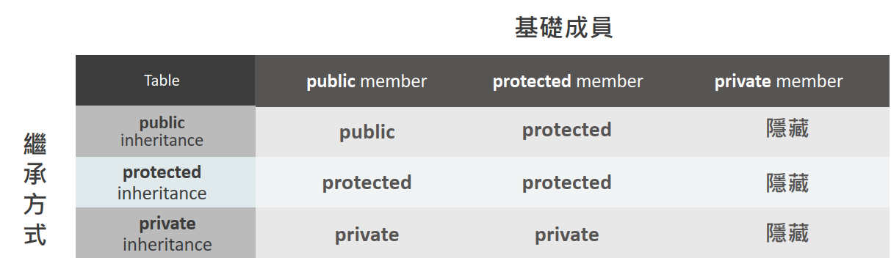

* # Outline
- [物件(Object)](#物件object)
- [物件導向(Object-Oriented)](#物件導向object-oriented)
- [物件變數(Object variable)](#物件變數object-variable)
- [物件指標(Object Pointer)](#物件指標object-pointer)
- [物件變數參考(Object Reference Variable)](#物件變數參考object-reference-variable)
- [封裝(Encapsulation)](#封裝encapsulation)
- [類別(Class)](#類別class)
- [建構函式(Constructor)](#建構函式constructor下稱-ctor)
- [Initialization List](#initialization-list)
- [Friend Class](#friend-class)
- [Copy Constructor](#copy-constructor)
- [Inline Function](#inline-function)
- [繼承(Inheritance)](#繼承inheritance)
- [多重繼承(Multiple Inheritance)](#多重繼承multiple-inheritance)
- [多型(Polymorphism)](#多型polymorphism)
- [Polymorphism -- Overloading](#polymorphism----overloading)
- [Polymorphism -- Overriding](#polymorphism----overriding)
  - [Is-a vs. Has-a](#is-a-vs-has-a)
  - [指派(Assign)](#指派assign)
  - [虛擬函式(virtual function)](#虛擬函式virtual-function)
  - [Dynamic Casting](#dynamic-casting)
  - [純虛函式(Pure virtual function)](#純虛函式pure-virtual-function)
  - [override & final](#override--final-specifierc11)
- [模板(Template)](#模板template) 
- [動態記憶體配置(Dynamic Memory Allocation)](#動態記憶體配置dynamic-memory-allocation)
- [File I/O](#file-io)
- [Exception & RTTI(Run-Time Type Information)](#exception--rttirun-time-type-information)
  - [Exception](#exception例外)
  - [RTTI(Run-Time Type Information)](#rttirun-time-type-information)
- [命名空間(namespace)](#命名空間namespace)
- [STL(Standard Template Library)](#stlstandard-template-library)
- [Reference](#reference)

# 物件(Object)
#### 一群**記憶體的集合**，擁有
1. 資料成員(Attribute)
2. 成員函式(Method)
---

# 物件導向(Object-Oriented)
#### 除了儲存資料外，還能運算資料
#### C 的 struct 只能儲存資料
#### C++ 的 class 的型別使資料與運算的函式屬於同一個物件下的成員

#### 因為可能歸屬於不同的變數下
1. 相同名稱的**資料成員**，但它的值不見得一樣
2. 相同名稱的**成員函式**，但它運算的結果不一定一樣

---
# 物件變數(Object Variable)
- 宣告

    變數宣告時，環境會依照類別中的宣告來建立物件，並將物件的記憶體位址指派給變數
    ```C++
    ClassName objectName;
    ```

- 成員存取
    ```C++
    objectName.dataMember    // 資料成員

    objectName.memberFunction()    // 成員函式
    ```

- 指派
    變數和物件是綁定的，即此變數不能再被指派另一個物件的**記憶體位址** ，指派時是將 "=" 右邊的物件的資料成員的**值**，複製給 "=" 左邊的物件的資料成員

    ```C++
    Circle c1, c2
    
    c1 = c2    // 此處僅將 c2 裡的值(value)複製給 c1. 兩變數的位址(address)並不會改變
    ```

- 物件變數參數

    物件變數當參數傳遞時，會先複製出一個新物件(objectName_new)，此新物件與原物件(objectName_origin)僅有值相同，而地址並不相同；新物件的改動不影響原物件，即 implementation 內若 function 更動 objectName_new 的值時不會影響到 objectName_origin 的值

    ```C++
    void function(ClassName objectName_new){}    // interface:

    function(objectName_origin);    // function call
    ```
- 物件變數返回值(返回物件 ClassName)

    ```C++
    ClassName function(){}      // interface:

    ClassName objectName = function();    // function call
    ```

---
# 物件指標(Object Pointer)
- 宣告

    不直接指派
    ```C++
    ClassName *pointerName;
    pointerName = new ClassName;
    ```
    直接指派(新增物件，使指標指向該物件)
    ```C++
    ClassName *pointerName = new ClassName;
    ```

- 建立物件

    普通形式: 
    ```C++
    new ClassName
    ```
    ctor(constructor)
    ```C++
    new ClassName()
    ```

- 指派

    與值會被綁定在物件身上不同，指標可以隨意指派至任意相同型別的物件位址
    ```C++
    pointerName = memoryAddress;

    pointerName = new ClassName;

    pointerName = &objectName;

    pointerName = otherPointerName;
    ```

#### 物件指標需避免 memory leak，要先進行釋放

- 成員存取(用**指標->成員**的方式，存取物件成員)
    ```C++
    pointerName->dataMeber    // 資料成員

    pointerName->memberFunction()    // 成員函式
    ```

- 物件指標參數
    ```C++
    void function(ClassName *pointer){}    // interface

    function(memoryAddress)    // function call
    ```
- 物件指標返回值(返回物件指標 ClassName* )
    ```C++
    ClassName *function(){}    // interface

    ClassName *pointer = function();    // function call
    ```

#### 物件變數與物件指標的差別即 call by value 和 call by pointer 的差別

---
# 物件變數參考(Object Reference Variable)
- 宣告

    ```C++
    ClassName &referenceName = objectName;
    ```
- 物件變數參考參數
    ```C++
    void function(ClassName &referenceName){}    // interface:

    function(objectName);    // function call
    ```
- 物件變數參考返回值
    ```C++
    ClassName &function(ClassName &referenctName)    // interface

    function(objectName)    // function call
    ```

---
# 封裝(Encapsulation)
#### 讓特定的物件不能被外界存取，是開發者(developer)用來限制使用者(user)的存取權限的手段。一般來說，只讓使用者接觸到開發者設定的 function interface 以進行調用，而禁止其直接存取變數或 function implementation

Example 1:

[Encapsulation](Encapsulation)

實現方式: 使用 private, protected, public

- private (default)
  - 只允許本類別(class)中的其他成員存取
- protected
  - 允許本類別(class)的子類別存取
- public
  - 允許所有類別(class)存取

---
# 類別(Class)
#### 一種型別，像 C++ 裡的 int 一樣
#### **依照物件的需求進行開發設計**

#### 類別裡包含
1. 物件成員=> 物件資料成員，物件成員函式
2. 類別成員=> 類別資料成員，類別成員函式
3. 建構函式(建構子)
4. 其他

### class 和 object 的差別: class 只是方法，object 是照著 class 這個方法所實際生成(實例化)的東西

---
# 建構函式(Constructor，下稱 ctor)
#### 建構函式: 實現物件初始化，可指定資料成員的初值，讓 user 可以不用進行完整的初值設定，

Example 1:

[Constructor](Constructor)

與 function 類似，惟以下幾點需要注意
- ctor 名稱須與 class 名稱相同(case sensitivity)
- 可以有參數列
- 不可以有返回型別
- 參數列可以指定預設值

#### 預設呼叫沒有參數的 ctor，若開發者沒有建立 ctor，**compiler 會自動生成沒有參數的 ctor，_該 ctor 不會初始化成員_**，但只有要任一 ctor，compiler 就不會自動生成(如果寫了一個有參數的 ctor，沒參數的 ctor 也必須要寫，因為 compiler 不會再進行自動生成)

#### Overloading Constructor
除了沒有參數的 ctor，也可以使用 overloading 建立多個 ctor

#### this pointer
每個成員函式都隱含著指標 this，this 會指向呼叫成員函式的 object 

功用: 
1. 在 IDE 中可讓 user 由參數名稱中判斷功能
2. 避免重名時變數的 scope holes

# Initialization List
#### 不會有歧異性
#### 不能使用 this pointer

Example 1:
```C++
Circle(int r = 0) : radius(r){}

Rectangle(int length = 0, int width = 0) : length(length), width(width){}
```

---
# Friend Class
#### 前備知識: private, protected, public(參[封裝(Encapsulation)](#封裝encapsulation))
- Friend Class
  - 如果 B_Class 宣告成 A_Class 的 friend class，則 B_Class 可以直接存取 A_Class 的所有成員(private, protected, public)
  
    ```C++
    #include <iostream>
    using namespace std;

    class ABC {   // A_Class
    private:
        char ch='A';
    protected:
        int num = 11;

        friend class XYZ;
    };
    class XYZ {   // B_Class
    public:
        void show(ABC &obj){
            cout << obj.ch << endl;   // can access cuz friend class
            cout << obj.num << endl;  // can access cuz friend class
        }
    };
    int main() {
        ABC abc;
        XYZ xyz;
        xyz.show(abc);      // Output: A
                            // Output: 11
        return 0;
    }
    ```
    
- Friend Function
  - 如果 X_Function 宣告成 A_Class 的 friend function，則可以透過 X_Function 直接存取 A_Class 的所有成員(private, protected, public)
  
    ```C++
    #include <iostream>
    using namespace std;

    class ABC {   // A_Class
    private:
        char ch='A';
    protected:
        int num = 11;
    public:
        friend void show(ABC &obj);   // X_Function
    };

    void show(ABC &obj){
        cout << obj.ch << endl;   // can access cuz friend function
        cout << obj.num << endl;  // can access cuz friend function
    }

    int main() {
        ABC abc;
        show(abc);          // Output: A
                            // Output: 11
        return 0;
    }
    ```

---
# Copy Constructor
#### copy ctor 是一種特殊的成員函數，從相同 class 的現有 object 來初始化一個新的 object，

copy ctor function prototype: `ClassName (const ClassName &old_obj);`

- 通過複制已存在對象的成員來初始化新創建對象的成員，已存在及新創建對象需要是相同 class，這種複制的過程稱為 copy/member-wise initialization

- copy ctor 可以由 programmer 定義或是交由 compiler 自動創建默認的

    Example 1:
    ```C++
    // Explicit copy ctor
    #include <iostream>

    using namespace std;

    class Point {
        private:
            int x, y;
        public:
            Point(int x1, int y1){
                x = x1;
                y = y1;
            }
            Point(const Point& p1){    	// Copy ctor
                x = p1.x;
                y = p1.y;
            }
            int getX() { return x; }
            int getY() { return y; }
    };

    int main()
    {
        Point p1(10, 15); // Normal ctor
        Point p2 = p1; // Copy ctor
        cout << "p1.x = " << p1.getX()
            << ", p1.y = " << p1.getY();    // Output: p1.x = 10, p1.y = 15
        cout << "\np2.x = " << p2.getX()
            << ", p2.y = " << p2.getY();    // Output: p2.x = 10, p2.y = 15
        return 0;
    }
    ```

    Example 2:
    ```C++
    // Implicit copy ctor
    #include<iostream>

    using namespace std;

    class Sample
    {   
        private:
            int id;
        public:
            void init(int x){
                id = x;    
            }
            void display(){
                cout << endl << "ID = " << id;
            }
    };

    int main()
    {
        Sample obj1;
        obj1.init(10);
        Sample obj2(obj1); //or Sample obj2 = obj1; 
        obj1.display();    // Output: ID = 10
        obj2.display();    // Output: ID = 10
        return 0;
    }
    ```

    還有以下情況也會調用 copy ctor
    ```C++
    Point getPoint(){        // return ctor from function
        Point p1(10, 15);
        return p1;
    }

    void setPoint(Point p1){    // pass ctor by value
        // do something
    }
    ```
    需注意的是，pass by pointer 和 pass by reference 不會調用 copy ctor

- Copy Ctor and Assignment Operator

    像上面 Example 所提到的例子都是 copy ctor

    ```C++
    Point p2 = p1    // copy ctor from Example 1

    Sample obj2 = obj1    // copy ctor from Example2

    MyClass t1, t2;
    MyClass t3 = t1;    // copy ctor...(1)
    t2 = t1;            // assignment operator...(2)
    ```
    回到 copy ctor 最初的定義，新對象由舊對象初始化，就是 copy ctor(1)；已存在的對象給已經初始化過的對象分配新值，就是 assignment operator(2)。兩者的差別是前者會創建一個新的記憶體位置，後者則不會

- Shallow Copy and Deep Copy

    Shallow Copy 時，新的那份會指向和舊的相同的記憶體位置，改動時會互相影響

    

    Deep Copy 時，新的那份會分配一份獨立的記憶體位置，改動時不互相影響

    

    既然 compiler 會建立一個默認的 copy ctor(implicit copy ctor)，為什麼還要 user-defined/explicit copy ctor?

    compiler 自己建的 copy ctor 僅是 shallow copy，當需要 deep copy 時必須要自定義，可以使用[動態記憶體配置](#動態記憶體配置dynamic-memory-allocation)來建立新的記憶體位置，達到 deep copy 的效果，具體例子請參考 [Ref](https://www.geeksforgeeks.org/copy-constructor-in-cpp/)

- What else?

  1. Private copy ctor: 將 copy ctor 設為 private，讓 class 只能有一個實例，不能被 copy
  
  2. 為什麼 Explicit copy ctor 需要 pass by reference？
  
      當調用 pass by value 時，像上例所述，pass by value 會調用 copy ctor，在 copy ctor 裡繼續調用 copy ctor，這會陷入 infinite recursion
        ```C++
        void setPoint(Point p1){    // pass ctor by value
            // do something
        }
        ```
    3. 我知道 Explicit copy ctor 為什麼不能用 pass by value ，那我可以使用 pass by pointer 嗎？

        理論上是可以的，但不正規也不建議如此，pointer 可能包含 NULL，這會導致 ctor fail
        
    4. 為什麼 Explicit copy ctor 需要包含 const?
    
        - 防止在 copy ctor 時，原件被意外更改
        - 也可以 copy rvalue，像是 const/temporary(maybe include expression) objects 等等
        
        綜上所述，加了 const 百利而無一害
    

---
# Inline Function
#### 實現方式: 在定義函式的前方加入 inline keyword
```C++
#include<stdio.h>
#include<iostream>
using namespace std;

inline square(int x) {
    return x*x;
}

int main() {
    cout << sqaure(10) << endl; // Output: 100
}
```
#### 實現機制
一般 call function 時，會先記錄當前位置後跳至 function 執行，跑完 function 再跳回之前程式記錄的位置；加入 inline keyword 後，在 compile 時就會把 function 預先展開，會比一般的 function 更快一點


#### 使用時機
inline 不一定保證會預先展開，compiler 會拒絕對過於複雜的 function 預展開，例如迴圈，switch 等等，最終可能適得其反

效率: 使用 inline，compiler 預展開 > 一般 function > 使用 inline，compiler 不預展開

對於 compiler 會不會展開 inline function 沒有一套明確的標準，但有幾個準則:
- 使用頻率高
- 簡單
- 短小

---
# 繼承(Inheritance)
#### 繼承: 建立一個以現有的 class(父類) 為基礎的新 class(子類)

Example 1:

[Inheritance](Inheritance)

- 子類/衍生類別(Child class/Derived class): 繼承已有物件
- 父類/基礎類別(Parent class/Base class): 被繼承物件

#### 當子繼別繼承父類時，就擁有父類的所有成員，可避免 duplication 及降低維護困難度

### _**子類擁有父類的所有成員，不代表有相應的存取權，子類不能存取父類的 private 成員(雖有繼承但不能直接存取)，而僅能存取 protected 和 public 的成員**_

-  private 代表不接受子類及物件存取
-  protected 代表接受子類但不接受物件存取(最好用於成員函式而非成員變數，可規避潛在風險，詳見 [protected 的真正用法](https://www.youtube.com/watch?v=qLe0LQ-5Oxc&list=PLnKth7bLoeC4llLBt1p_Sy0BzlMEHqnwZ&index=8))
-  public 代表接受物件存取

子類可以
- 新增父類沒有的成員
- 新增父類已有的成員，會取代父類的成員
  
(註: 成員包含成員變數和成員函式)

#### 子類在宣告繼承父類的時候，可以用存取修飾詞(access specifier)限制父類的成員在子類中的新存取層級

```C++
class  <derived_class_name> : <access-specifier> <base_class_name>
{
        //body
}
```

Example 1:
```C++
class Circle : private Shape{};
class CRectangle : protected Shape{};
class CTriangle : public Shape{};
```

#### 存取修飾詞(access specifier)

- public (上限為 public，其餘固定)
  - 在子類中繼承自父類的所有成員等級均不變

- protected (上限改為 protected，其餘固定)
  - 在子類中繼承自父類的 private 與 protected 的成員不變，public 成員改為 protected

- private (上限改為 private，有繼承到但**無法存取**)
  - 子類繼承的所有父類成員皆**不可存取**

#### 子類繼承父類的存取範圍



特別注意父類的 private member，子類無論如何繼承都無法存取，因為 protected member 已經扮演相應的角色

---
# 多重繼承(Multiple Inheritance)
#### 除了單一的繼承外，C++ 也有多重繼承，多重繼承複雜且麻煩，通常只會讓事情更糟 : ( ，在許可的情況下盡量使用單一鏈狀繼承

Example 1:

[Multiple Inheritance](Multiple%20Inheritance/Multiple%20Inheritance.cpp)


Example 2:

[The Diamond Problem](Multiple%20Inheritance/The%20Diamond%20Problem.cpp)


### 多重繼承需注意的重點
1. 繼承的兩個父類若有兩個相同的 member 時，使用 resolution operator(::)載明父類
2. 當形成 diamond shape 的繼承時，需要將父類宣告為 virtual class，以避免重覆調用及 ambiguities(相同的兩份成員)
3. 繼承的父類若有需要初始化參數的 ctor，需要在定義子類時一同提供
4. 繼承的祖父(或以上)類若有需要初始化參數的 ctor，需要在定義子類時一同提供

---
# 多型(Polymorphism)
#### 多型(Polymorphism): 在不知道任何情況下使用類型(type)的能力，其又分為靜態式(static/compile-time polymorphism)和動態式(dynamic/runtime polymorphism)。正如其字面意思，靜態式是編譯時的，動態式是運行時的

#### 在 C++ 中，靜態式多型包含了 [overloading](#polymorphism----overloading) 及 [template](#模板template)；動態式多型則是 [overriding](#polymorphism----overriding)，具體是由含 [virtual](#c-使用-virtual-實現-overriding) 的 base class 衍生的 derived class 實現

--- 
# Polymorphism -- Overloading
#### 可以簡化函式，允許函式同名但有不同的 function signature
function signature: 參數順序，數量，型態，不包含 return type & value

- Function Overloading
  ```C++
  #include <iostream>
  using namespace std;
  
  void add(int a, int b)
  {
    cout << "sum = " << (a + b);
  }
  
  void add(double a, double b)
  {
      cout << endl << "sum = " << (a + b);
  }
  
  int main()
  {
      add(10, 2);       // Output: 12
      add(5.3, 6.2);    // Output: 11.5
      return 0;
  }
  ```
- Constructor Overloading
  - 參[建構函式(Constructor)](#建構函式constructor下稱-ctor)範例
- Operator Overloading
  ```C++
  #include<iostream>
  using namespace std;
  
  class Complex {
  private:
      int real, imag;
  public:
      Complex(int r = 0, int i = 0) {real = r;   imag = i;}
      
      // This is automatically called when '+' is used with
      // between two Complex objects
      Complex operator + (Complex const &obj) {
          Complex res;
          res.real = real + obj.real;
          res.imag = imag + obj.imag;
          return res;
      }
      void print() { cout << real << " + i" << imag << '\n'; }
  };
  
  int main()
  {
      Complex c1(10, 5), c2(2, 4);
      Complex c3 = c1 + c2;
      c3.print();   // Output: 12 + i9
  }
  ```

---
# Polymorphism -- Overriding
#### 允許子類對 function 進行個別實作，替換父類的 function，子類 override 時，function signature 和回傳型別需與父類相同，又稱為 subtyping (正確的 subtyping 要在父類加上 virtual)

Example 1:
```C++
#include<iostream>
using namespace std;

class BaseClass
{
public:
    void Display()
    {
        cout << "\nThis is Display() method"
                " of BaseClass";
    }
};

class DerivedClass : public BaseClass
{
public:
    void Display()
    {
        cout << "\nThis is Display() method"
               " of DerivedClass";
    }
};

int main()
{
    DerivedClass dr;
    BaseClass &bs = dr;
    bs.Display();               // Output: This is Display() method of BaseClass
    dr.Display();               // Output: This is Display() method of DerivedClass
                                // **Problem here: 同一個 dr object 因為使用不同的調用而產生不同的結果
                                
    dr.BaseClass::Display();    // Output: This is Display() method of BaseClass
}
```
### 上方的程式碼中都是同一個 dr object(bs 已指向 dr) 因為使用不同的調用而產生不同的結果，顯然沒有達到 Override 的效果

---
## Is-a vs. Has-a
#### _兩者都是用來描述**類別與類別間的關係**_

### Note: is-a代表類別之間階層的父子關係。has-a代表類別之間的whole/part關係

- Is-a(用於繼承): 子類 is-a 父類

  - A is-a B，代表著 A 其實也是一種 B. 
    
    Example 2: 
    ```C++
    // Circle 也是一種 Shape

    class Shape{ };

    class Circle : public Shape{ };
    ```

    Example 3: 
    
    有父子關係的型別：電子設備 -> 電話 -> 行動電話 -> 智慧型手機
    
    物件：你身上的手機
    
    你身上的手機 is-a 智慧型手機 is-a 行動電話 is-a 電話 is-a 電子設備
    
    "你身上的手機"是一個物件，也是一個型別"為智慧型手機"的物件，也是一個型別為"行動電話"的物件，也是一個型別為"電話"的物件，也是一個型別為"電子設備"的物件
    
    你身上的手機可以宣告為"你身上的手機"，也可以宣告為"智慧型手機"，也可以宣告為"行動電話"，也可以宣告為"電話"，也可以宣告為"電子設備"

- Has-a: 手機 has-a 晶片

    Example 4:
    ```C++
    // Phone has-a Chip.(手機與晶片都是 object)

    class Chip{};
     
    class Phone{
       Chip chip;
    };
    ```

---
## 指派(Assign)
#### 子類宣告的物件指派到父類宣告的物件，反之則不可行。是物件的複製(copy-by-value)，_**不是多型的應用**_

### 父類**不可**指派到子類 => 替子送死(X)
### _**子類指派到父類 => 代父出征(O)**_

  1. 指標(Pointer)
  2. 參考(Reference)
  3. 群體(Group)
  4. 參數(Parameter)

#### 子類內如果定義與父類相同的成員函式
1. 如果子類指派到父類，會執行父類定義的成員函式
2. 如果子類沒有指派到父類，仍會執行父類的成員函式(除非使用 virtual keyword 才可以 override，執行子類成員函式)

---
## 虛擬函式(Virtual Function)
#### C++ 使用 virtual 實現 Overriding

Example 5:

[Virtual Function](Virtual%20Function)

- 父類

  - A. 宣告虛擬函式
  
    在函式宣告敘述前加入 keyword virtual.

    Example 6:
    ```C++
    virtual void showInfo();    // declare in .h
    
    void Classname::showInfo(){ // define in .cpp
        // do something
    }
    ```

  - B. 宣告虛擬解構函式(**一定要宣告**)
  
    在 class dtor 前加入 keyword virtual.
    
    Example 7:
    ```C++
    virtual ~ClassName(){}
    ```

- 子類
  - A. Override 父類宣告的虛擬函式
  
    再次宣告及定義父類中的虛擬函式

    Example 8:
    ```C++
    virtual void showInfo();    // declare in .h
    
    void Classname::showInfo(){ // define in .cpp
        // do something
    }
    ```

  - B. 以指標或參考呼叫虛擬函式
    執行子類 override 的內容，指標使用 (->)，參考使用 (.)

    Example 9:
        
    ```C++
    // in Example 5 Virtual Function
    CShape *csPtr;
    CCircle cc4;
    cc4.setRadius(100);
    csPtr = &cc4;
    CShape &csRef2 = cc4;
    csPtr->showInfo();
    csRef2.showInfo();
    ```

[Polymorphism -- Overriding](#polymorphism----overriding) 的 Example 使用了 virtual 後，正常 override Display function

```C++
#include<iostream>
using namespace std;

class BaseClass
{
public:
    virtual void Display()    // add virtual
    {
        cout << "\nThis is Display() method"
                " of BaseClass";
    }
};

class DerivedClass : public BaseClass
{
public:
    void Display()
    {
        cout << "\nThis is Display() method"
               " of DerivedClass";
    }
};

int main()
{
    DerivedClass dr;
    BaseClass &bs = dr;
    bs.Display();               // Output: This is Display() method of DerivedClass
    dr.Display();               // Output: This is Display() method of DerivedClass
                                // **Problem has been solved

    dr.BaseClass::Display();    // Output: This is Display() method of BaseClass
}
```
    
## Dynamic Casting
#### 大原則: 父類不能指派給子類(不能替子送死)
#### 當定義時為子類，傳遞 Parameter 是父類時，可以透過 Dynamic Casting 轉為原先定義時的子類

- A. 指標

    `dynamic_cast<type*>(pointer)`

    失敗時返回 NULL pointer
  
    Example 10:
    ```C++
    void doubleShape(CShape *csPtr){
        CCircle *ccPtr = dynamic_cast<CCircle *>(csPtr);
    }

    CCircle cc5;
    doubleShape(&cc5);
    ```

- B. 參考
    
    `dynamic_cast<type&>(reference)`

    失敗時拋出 bad_cast Exception
  
    Example 11:
    ```C++
    void doubleShape(CShape &csRef){
        CCircle &ccRef = dynamic_cast<CCircle &>(csRef);
    }

    CCircle cc5;
    doubleShape(cc5);
    ```

---
## 純虛函式(Pure Virtual Function)
#### _**類別中若宣告或繼承了一個或多個純虛函式，此類別即為抽象類別(Abstract Class)**_
#### _**子類一定要 override 父類的純虛函式，否則子類也會變成 Abstract class**_

Example 12:

[Pure Virtual Function](Pure%20Virtual%20Function)

(註: 僅修改 main.cpp, CShape.h, CShape.cpp，其餘檔案和[虛擬函式(virtual function)](#虛擬函式virtual-function)的範例相同)

- A. 宣告純虛擬函式
  純虛擬函式只有宣告，沒有定義

  `virtual type_name (parameter list) = 0;`
   

- B. Abstract class
  1. 不可建立 object，但可建立及使用 object pointer or object reference
  2. 單純讓子類繼承而非建構物件
  
#### Pure virtual function 是為了強迫子類進行 override

### Summary for virtual function
- virtual function: 讓子類決定要不要 override 父類的 function，不 override 就會使用父類的 function
- Pure virtual function: 強迫子類 override virtual function，否則無法建立 object (因為子類也會因為有父類的 Pure virtual function 而變成 abstract class)
---
## override & final Specifier(C++11)
#### override 指示符通常加在子類 function 後，確認子類是否會 override 父類的實作，若否則報 Error

Example 13:
```C++
#include <iostream>

using namespace std;

class A
{
public:
    virtual void foo() const{    //因為 A::foo() 多了 const keyword，所以 B::foo() 沒有 override A::foo()
        cout << "Base Class" << endl;
    }
};

class B : public A
{
public:
    void foo() /*override*/{
        cout << "Derived Class" << endl;
    }
};

int main(){
    A *ptr = new B();
    ptr->foo();
    return 0;
}
```
Output: Base Class

if uncomment `override` specifier:

error: `'void B::foo()' marked 'override', but does not override`


Example 14:
```C++
#include <iostream>

using namespace std;

class A
{
public:
     void bar() {    //因為 A::bar() 沒有 virtual keyword，所以 B::bar() 沒有 override A::bar()   
        cout << "Base Class" << endl;
    }
};

class B : public A
{
public:
    void bar() /*override*/{
        cout << "Derived Class" << endl;
    }
};

int main(){
    A *ptr = new B();
    ptr->bar();
    return 0;
}
```
Output: Base Class

if uncomment `override` specifier:

error: `'void B::bar()' marked 'override', but does not override`
<br><br/>

#### final 指示符通常加在父類 function 後，確認是否會有子類 override 父類的實作，若是則報 Error

Example 15:
```C++
#include <iostream>

using namespace std;

class A
{
public:
     virtual void bar() final {    //因為 B::bar() override A::bar()
        cout << "Base Class" << endl;
    }
};

class B : public A
{
public:
    void bar() {
        cout << "Derived Class" << endl;
    }
};

int main(){
    A *ptr = new B();
    ptr->bar();
    return 0;
}
```
error: `virtual function 'virtual void B::bar()' overriding final function`

if comment out `final` specifier:

Output: Derived Class

---
# 模板(Template)
#### template 可以將類型(type)參數化，因為編譯器根據需要自動生成該類型的程式碼，實現程式碼重用(code reuse)的一種工具
#### 需特別注意的是 C++ 的 template 沒有真正達到 parametric polymorphism 的 code reuse，其會同時存在不同 type 的程式碼，意謂著當編譯器編譯時， template 會根據調用與否而自行擴張

- Function Templates

template 能接受任意類型的參數，並生成相對應的函數，這些函數可返回任意類型的值，而不需要對所有可能的數據進行 function overloading，某程度上與 macro 的作用相同

在 template 引入 C++ 後，為了避免 template 的 class keyword 和原先的 class 的使用可能令人混淆，所以引入了 typename keyword，但兩個 keyword 在 template 的作用基乎一樣

具體實現:
```C++
template <class identifier> function_declaration;
template <typename identifier> function_declaration;
```

Example 1:
```C++
#include <iostream>

using namespace std;

template <class T>
T sum(T a, T b) {     // return T type
  return a + b;
}

int main () {
    int x = 10, y = 20;
    cout << sum(x, y) << endl; // Output: 30
    double xd = 10.3, yd = 20.8;
    cout << sum(xd, yd) << endl; // Output: 31.1

    cout << sum(x, xd) << endl; // error
}
```
template 接受多個不同類型的 type

Example 2:
```C++
#include <iostream>

using namespace std;

template <class T, class U>
T smaller(T a, U b) {     // return T type
  return (a < b ? a : b);
}

int main () {
  int x = 100;
  double y = 31.1;
  cout << smaller(x, y) << endl; // Output: 31
}
```

- Class Templates

template 可以定義在 class 內，使得該 class 能有通用型的成員

Example 3:
```C++
#include <iostream>

using namespace std;

template <class T>
class Pair {
    private:
        T var1, var2;
    public:
        Pair (T a, T b) : var1(a), var2(b) {}    // initialization list
        T GetMax();
};

template <class T>
T Pair<T>::GetMax() {
    return (var1 > var2 ? var1 : var2);
}

int main()
{
    Pair <int> myobj(11, 22);
    cout << myobj.GetMax() << endl;   // Output: 22
    Pair <double> myobj2(23.43, 5.68);
    cout << myobj2.GetMax() << endl;  // Output: 23.43
    return 0;
}
```

- Template Specialization

以上介紹的兩種 template 類型，不管什麼類型，template 都是使用相同的方法操作並回傳，而 template specialization 是針對不同類型的傳入，能使用不同的方法操作並回應

Example 4:
```C++
#include <iostream>

using namespace std;

template <class T>
class Pair {
  private:
    T var1, var2;
  public:
    Pair(T a, T b) : var1(a), var2(b) {}    // initialization list
    int module();
};

template <class T>    // 創建類型 T，指涉 int 以外的類型
int Pair<T>::module(){
    return -1;
}

template< >     // 已知 int 類型，不用另外創建
int Pair<int>::module() {
    return var1 % var2;
}

int main () {
    Pair <int> myints (100, 75);
    Pair <float> myfloats (100.0, 75.0);
    cout << myints.module() << endl;      // Output: 25
    cout << myfloats.module() << endl;  // Output: -1
    return 0;
}
```

- Parameter values for templates

function template 和 class template 除了使用 class 和 typename 定義新的 type 外，也可以包含基本的 data type 當作正常 function 傳參使用，下例定義一個用來儲存 array 的 class template

Example 5:
```C++
#include <iostream>

using namespace std;

template <class T = int, int N = 5>   // can set default value in template
class array {
    private:
        T memblock [N];   // define array type
    public:
        void setmember (int x, T value);
        T getmember (int x);
};

template <class T, int N>
void array<T,N>::setmember (int x, T value) {
    memblock[x]=value;
}

template <class T, int N>
T array<T,N>::getmember (int x) {
    return memblock[x];
}

int main () {
    array <> myints;    // using default template
    array <float, 5> myfloats;
    myints.setmember (0, 100);
    myfloats.setmember (3, 3.1416);
    cout << myints.getmember(0) << endl;    // Output: 100
    cout << myfloats.getmember(3) << endl;    // Output: 3.1416
    return 0;
}
```
template 也可以設置默認值，在設置默認值時需注意以下幾點:

1. 設了默認值，常數就必須要有默認值，像 `template <class T = int, int N>` 會報錯
2. 設了默認值，還是需要 `<>`，像是 `array myints;` 會報錯
3. 設了默認值，常數值需對應傳參位置
   
    ```C++
    template <class T = int, class U, int N = 5>

    array test0                  // error
    array <> test1               // correct
    array <int> test2            // correct
    array <int, int> test3       // correct
    array <5> test4              // error
    array <float, 5> test5       // error
    array <int, int, 3> test6    // correct
    ```


### Summary for template

- template 在 compile-time 時能依據傳遞的參數自行擴展、實例化(instantiate)一個相對應的 function

- 在 multiple-file project 時，interface 和 implementation 是分開的，通常一個在 .h file，另一個在 .cpp file，但如果將 template 像一般函數一樣僅將 declare 單獨存放在 interface，就會出現問題。原因是當讀到 .cpp 中的 template instantiation 時，compiler 需要訪問 function implementation，如果 implementation 沒出現在頭文件中，就會無法訪問，導致無法 instantiate

- 但我還是需要 template interface 和 template implementation 分離? [Ref Link](https://stackoverflow.com/questions/495021/why-can-templates-only-be-implemented-in-the-header-file)

  1. 使用 .tpp 檔儲存你的 template implementation
   
      Foo.h
      ```C++
      template <typename T>
      struct Foo
      {
          void doSomething(T param);
      };

      #include "Foo.tpp"
      ```
      Foo.tpp
      ```C++
      template <typename T>
      void Foo<T>::doSomething(T param)
      {
          //implementation
      }
      ```
  2. explicit instantiation 規範特定類型可用

      Foo.h
      ```C++
      // no implementation
      template <typename T> struct Foo { ... };
      ```
      Foo.cpp
      ```C++
      // implementation of Foo's methods

      // explicit instantiations
      template class Foo<int>;
      template class Foo<float>;
      // You will only be able to use Foo with int or float
      ```

What else?

C++ 之所以推出 template 是為了[封裝](#封裝encapsulation)資料結構，資料結構重視資料的存儲和 CRUD(Create, Read, Update, Delete)，開發者想封裝這些資料結構，但 data type 無法提前預測，於是 template 橫空出世，而 [STL](#stlstandard-template-library) 就是 C++ 對資料結構封裝後所形成的標準庫

---
# 動態記憶體配置(Dynamic Memory Allocation)
- 靜態配置: 在 compile time 時決定變量的內存空間，一旦決定就不得再更改
- 動態配置: 在 runtime 時依照預先編寫好的程式進行空間的分配，可依據指令隨時改變(通常在不確定使用者會輸入多少內容時使用)

- C
  - Allocate: malloc() (分配失敗返回 NULL pointer)

    `void *malloc(size_t size);`

  - Deallocate: free()

    `void free(void *ptr);`

[Dynamic_Allocation.c](Dynamic%20Memory%20Allocation/Dynamic_Allocation.c)

- C++
  - Allocate: new()

    `void *operator new(size_t size);`

  - Deallocate: delete()
  
    `void operator delete(void* ptr);`

[Dynamic_Allocation.cpp](Dynamic%20Memory%20Allocation/Dynamic_Allocation.cpp)

#### malloc/free vs. new/delete
- 計算占用內存: malloc 需使用 sizeof() 指定內存大小；new 則交由 compiler 自己計算
- 配置成功: malloc 返回 void* 類型，仍需進行強制轉型；new 返回指定類型的指標
- 配置失敗: malloc 返回 NULL pointer；new 會拋出 bad_alloc Exception
- new/delete 有 Constructor/Destructor，可以 Overloading，此處不再過多闡釋
  
---
# File I/O
#### C++ 中，輸入(Input)和輸出(Output)的資料是一串有先後次序的 data stream，處理順序是先進先處理，輸入和輸出的資料來源可能是鍵盤、螢幕、檔案或字串

使用 device 為 program 提供 input(program 視為 file)，然後 program 在特定 device 上返回 output(program 視為 file)，而作為中間媒介的 byte sequence，被統稱為 stream。換句話說，stream 就只是 data flow in sequence。program 與這些 device 則被統稱為 "console I/O operation"

C++ 的 I/O system 包含了定義了如何處理 file 方法的 class，包括 istream，ofstream, fstream，在使用這些方法時，需引入相應的 header file

C++ I/O class hierarchy


- ios
  - stands for input output stream
  - 是所有 I/O class hierarchy 裡 class 的 base class
- istream
  - stands for input stream
  - derived from the class 'ios'
  - extraction operator(>>) 在此處被 overload，處理從 file 到 program 的 input stream
  - This class declares input functions such as get(), getline() and read().
- ostream
  - stands for output stream
  - derived from the class 'ios'
  - insertion operator(<<) 在此處被 overload，處理從 file 到 program 的 output stream
  - This class declares output functions such as put() and write().
- ifstream
  - stands for input file stream
  - 提供 input operations
  - 包含 open() function with default input mode
  - 繼承 get(), getline(), read(), seekg() and tellg() functions from the istream
- ofstream
  - stands for output file stream
  - 提供 output operations
  - 包含 open() function with default output mode
  - 繼承 put(),  write(), seekp() and tellp() functions from the ostream
- fstream
  - stands for file stream
  - support for 同時的 input 和 output operations
  - 繼承 istream 和 ostream 的所有 functions

#### C++ 的文件處理主要使用 fstream, ifstream, ofstream 三個 classes，這些 classes 包含在 fstream header file 中

| Stream class | Write on files |  Read from files | Default open modes |
| -----------  | --- | --- | ------------------- |
| **ofstream** | Yes | No  |       ios::in       |
| **ifstream** | No  | Yes |       ios::out      |
| **fstream**  | Yes | Yes | ios::in \| ios::out |

|  Flag  | Stands for | Access |
|  ----- | ---------- | ------ |
|   in   |   input    | File open for reading, internal stream 支持 input operations |
|   out  |   output   | File open for writing, internal stream 支持 output operations |
| binary |   binary   | 以 binary mode 操作而非 text |
|  ate   |   at end   | output position 從文件末尾開始 |
|  app   |   append   | output operations 從文件末尾開始，附加到現有內容後 |
| trunc  |  truncate  | 在文件打開前將已存在文件內的所有內容丟棄 |

| ios seek flags | meaning |
| -------------- | ------- |
|      beg       | The offset is relative to the beginning of the file (default) |
|      cur       | The offset is relative to the current location of the file pointer |
|      end       | The offset is relative to the end of the file |


Example 1:
```C++
// read and write file by using ifstream & ofstream classes

#include <iostream>

// fstream header file for ifstream, ofstream, fstream classes
#include <fstream>

using namespace std;

int main()
{
    // Creation of ofstream class object
    ofstream fout;

    string line;

    // by ofstream default open mode = ios::out mode，會將原先存在文本的內容全部刪除
    // 如果要在保留原先存在的內容並繼續附加其它內容，應該使用 ios:app
    // fout.open("sample.txt", ios::app);
    fout.open("sample.txt");

    // Execute a loop If file successfully opened
    while (fout) {

        // Read a Line from standard input
        getline(cin, line);

        // Press -1 to exit
        if (line == "-1")
            break;

        // Write line in file
        fout << line << endl;
    }

    // Close the File
    fout.close();

    // Creation of ifstream class object to read the file
    ifstream fin;

    // by ifstream default open mode = ios::in mode
    fin.open("sample.txt");

    // Execute a loop until EOF (End of File)
    while (fin) {

        // Read a line from file
        getline(fin, line);

        // Print file content in console
        cout << line << endl;
    }

    // Close the file
    fin.close();

    return 0;
}
```
Example 2:
```C++
// read and write file by using fstream

#include <iostream>

/* fstream header file for ifstream, ofstream,
   fstream classes */
#include <fstream>

using namespace std;

int main()
{
    // Creation of fstream class object
    fstream fio;

    string line;

    // fstream::open 一定要註明是 ios::app 還是 ios::trunc
    // ios::trunc 會刪除原先存在文本的內容
    // ios:app 會保留原先內容並在文件末尾進行添加
    // fio.open("sample.txt", ios::in | ios::out | ios::app);
    fio.open("sample.txt", ios::in | ios::out | ios::trunc);

    // Execute a loop If file successfully opened
    while (fio) {

        // Read a Line from standard input
        getline(cin, line);

        // Press -1 to exit
        if (line == "-1")
            break;

        // Write line in file
        fio << line << endl;
    }

    // Execute a loop until EOF (End of File)
    // seekg -> read pointer, seekp -> write pointer
    // ios::beg -> begin of file, ios::end -> end of file, ios::cur -> current position
    // point read pointer at beginning of file
    fio.seekg(0, ios::beg);

    while (fio) {

        // Read a line from file
        getline(fio, line);

        // Print file content in console
        cout << line << endl;
    }

    // Close the file
    fio.close();

    return 0;
}
```

What else?
  - fstream::open() 時，一定要註明 ios::app 或是 ios::trunc，否則當檔案不存在時，不會自動創建，只會顯示 failing to open file
  - 若檔案與程式在不同位置，要加上完整路徑，例如:
    `fstream::open("C:\\oop\\sample.txt", ios::in | ios:: out, ios::app);` or `fstream::open("C:/oop/sample.txt", ios::in | ios:: out, ios::app);`。不要使用 single backslash ，其為 escape sequence ，不會產生有效路徑

    other examples: [Ref](https://www.geeksforgeeks.org/file-handling-c-classes/)

---
# Exception & RTTI(Run-Time Type Information)

## Exception(例外)
#### Exception 是當 program 在執行時，如果遇到它無法解決的錯誤，可以依據提前寫在 exception 的內容，讓 user 知道發生了什麼事，而不是無預警的 program 中斷然後噴 Error

if-else statement 可以做簡單的 exception handling
```C++
If(b != 0){
cout<< “a / b=” << double(a / b)<<endl;
}

else{
cout << "Cannot divide by zero" << endl;
}
```
如果所有的例外都能事先知道，可以用 if-else，但用起來會很繁瑣。大部分情況都是無法預先判斷的，這時候 try-catch 就很有用

```C++
try{
程式（可能造成例外的敘述）
    throw exception;

}

catch （exception type）{/*錯誤處理*/}
catch （exception type）{/*錯誤處理*/}
catch（…）{/*處理所有的例外 */}
```

Example 1:
```C++
#include <iostream>

using namespace std;

int main(){
    int x, y;
    cin >> x >> y;
    try{
        if(y == 0){
           throw "Cannot divide by zero";
           cout << "Hello" << endl;     // 寫在 throw 後的語句永遠不會被執行
        }
        else if(y < 0)   throw y;

        cout << (double)x / y << endl;
    }
    catch(int a){       // integer type handler
        cout << "Error happened, y is " << a << endl;
    }
    catch(const char* err){        // string type handler
        cout << err << endl;
    }
    catch(...){     // generic type handler，最後使用 generic 獲取所有沒被包含到但被 throw 的 type
        cout << "Undefined error !" << endl;
    }
    cout << "x = " << x << endl;
    cout << "y = " << y << endl;
}
```
```
Input: 5 0
Output: 
Cannot divide by zero
x = 5
y = 0

Input: 5 -1
Output: 
Error happened, y is -1
x = 5
y = -1

Input: 5 3
Output:
1.66667
x = 5
y = 3
```
- try 後方應緊鄰 catch，否則會報錯`error: expected 'catch' before 'xxx'`
- 當 try 區塊發生例外時，會找到符合 catch 的 parameter type，執行該 catch 區塊的內容
- 因為 throw exception 後會馬上跳至 catch，寫在 throw 後方的陳述式不會在 throw 後被執行
- catch 和 catch 間不應該有其它陳述式，否則會報錯 `expected primary-expression before 'catch'`
- catch 結束後會從最後的 catch 處理內容後的第一行敘述繼續執行


| Exception |             Describe             |
| --------- | ---------------------------------|
| std::exception | 該例外是所有標準 C++ 例外的父類 |
std::bad_alloc | 該例外可以通過 new 拋出 |
std::bad_cast |	該例外可以通過 dynamic_cast 拋出 |
std::bad_exception | 處理 C++ 程式中無法預期的例外時非常有用 |
std::bad_typeid | 該例外可以通過 typeid 拋出 |
std::logic_error | 理論上可以通過讀取代碼來檢測到的例外 |
std::domain_error |	使用了一個無效的數學域時，會拋出該例外 |
std::invalid_argument |	當使用了無效的參數時，會拋出該例外 |
std::length_error |	創建了太長的 std::string 時，會拋出該例外 |
std::out_of_range |	該例外可以通過方法拋出，例如 std::vector 和 std::bitset<>::operator |
std::runtime_error | 理論上不可以通過讀取代碼來檢測到的例外 |
std::overflow_error | 發生數學上溢時，會拋出該例外 |
std::range_error | 嘗試存儲超出範圍的值時，會拋出該例外 |
std::underflow_error | 當發生數學下溢時，會拋出該例外 |

Example 2:
```C++
#include <iostream>
#include <exception>

using namespace std;

int main(){
    double *ptr[100000];
    try{
        for(int i = 0; i < 100000; ++i){
            ptr[i] = new double [100000000];
            cout << "Allocate 100000000 doubles in ptr[" << i << "]" << endl;
        }
    }
    catch(bad_alloc &memoryAllocationException){
        cout << "Exception occurred: " << memoryAllocationException.what() << endl;
    }
    return 0;
}
```
```
Output:
Allocate 10000000 doubles in ptr[0]
Allocate 10000000 doubles in ptr[1]
Allocate 10000000 doubles in ptr[2]
Allocate 10000000 doubles in ptr[3]
Exception occurred: std::bad_alloc
```

#### 也可以自定義 exception，繼承自 exception class
Example 3:
```C++
// User-defined exceptions
#include <iostream>
#include <exception>

using namespace std;

class Divide_By_Zero_Exception : public exception{
    public:
        const char * what() const throw(){
            return "Divide By Zero Exception\n";
        }
};

int main(){
    try{
        int a, b;
        cin >> a >> b;
        if (b == 0){
            Divide_By_Zero_Exception d;
            throw d;
        }
        else{
            cout << "a / b = " << a/b << endl;
        }
    }
    catch(Divide_By_Zero_Exception& e){
        cout << e.what();
    }
    return 0;
}
```
```
Input: 5 0
Output: Divide By Zero Exception
```

巢狀 try-catch

Example 4:
```C++
// Nested try-catch blocks
#include <iostream>

using namespace std;

int main()
{
    try     // Outside try
    {
        try{        // Inside try
            cout << "throw a int error" << endl;
            throw 1;        // Inside throw
            cout << "this should not print" << endl;
        }
        catch(int i_err){       // Inside catch
            cout << "Inside error: " << i_err << endl;
        }
        cout << "throw a double error" << endl;
        throw 1.5;      // Outside throw
        cout << "this should not print" << endl;
    }
    catch(double d_err){    // Outside catch
        cout << "Outside error: " << d_err << endl;
    }
    return 0;
}

```
```
Output:
throw a int error
Inside error: 1
throw a double error
Outside error: 1.5
```

Exception 也可以被重覆丟出(Rethrow)
```C++
// Rethrow exception
#include <iostream>
#include <exception>

using namespace std;

void throwException(){
    try{
        cout << "Function throwException throws an exception" << endl;
        throw exception();
    }
    catch(exception &caughtException){
        cout << "Exception handled in function throwException" << endl;
        cout << "Function throwException rethrows exception" << endl;
        throw;   // 重新丟出 exception
    }
    cout << "this should not print" << endl;
}

int main()
{
    try{
        throwException();
    }
    catch(exception &e){
        cout << "Exception handled in main" << endl;
    }
    return 0;
}
```
```
Function throwException throws an exception
Exception handled in function throwException
Function throwException rethrows exception
Exception handled in main
```


### Summary for Exceptions
程式碰到 try 區塊時
- try 區塊內發生 exception，程式會跳過整個 try 區塊內還沒執行的程式，尋找適當的 catch 區塊
  - 沒找到適當的 catch 區塊
    - 尋找外層是否有適當的 catch 區塊
    - 沒有適當的 catch 區塊匹配時，程式結束 ---> Program termination
  - 找到適當的 catch 區塊，執行該 catch 區塊
- try 區塊沒發生 exception，跳過 catch 區塊

從 catch 區塊後方繼續執行

---
## RTTI(Run-Time Type Information)
#### C++ 引入這個機制是為了讓 program 能在運行時根據父類的指標或引用就能獲得該對象的實際類型，但現今已不侷限於此，typeid operator 現如今也能辨識所有 built-in type
C++ 是一門靜態語言，這意謂著它僅在 compile-time 檢查變數的 data type，但由於其物件導向的 polymorphism 特性，指標或引用本身的 data type 和所儲存實際 type 不一致(宣告父類，但實際指向子類)，我們有時候會需要知道在 runtime 時該變數的資訊(子類除了繼承自父類外，還有一些僅子類有，但父類沒有的資訊)，想要獲得這些資訊沒有什麼好方法，因此造就 RTTI 橫空出世，**使用 RTTI 記得引入 typeinfo header file**

- typeid: 返回實際的 type

  - 對於 C++ 的 built-in type 的 typeid

    Example 5:
    ```C++
    #include <iostream>
    #include <typeinfo>
    #include <cxxabi.h>

    using namespace std;

    const char* TypeToName(const char* name){       // using abi::__cxa_demangle
        const char* __name = abi::__cxa_demangle(name, nullptr, nullptr, nullptr);
        return __name;
    }

    int main(){
        short s = 2;
        unsigned ui = 10;
        int i = 10;
        char ch = 'a';
        wchar_t wch = L'b';
        float f = 1.0f;
        double d = 2;

        cout<<TypeToName(typeid(s).name())<<endl; //Output: short
        cout<<TypeToName(typeid(ui).name())<<endl; //Output: unsigned int
        cout<<TypeToName(typeid(i).name())<<endl; //Output: int
        cout<<TypeToName(typeid(ch).name())<<endl; //Output: char
        cout<<TypeToName(typeid(wch).name())<<endl; //Output: wchar_t
        cout<<TypeToName(typeid(f).name())<<endl; //Output: float
        cout<<TypeToName(typeid(d).name())<<endl; //Output: double

        return 0;
    }
    ```
  - 對於自己定義的 class (RTTI 核心)

    Example 6:
    ```C++
    #include <iostream>
    #include <typeinfo>
    #include <cxxabi.h>

    using namespace std;

    const char* TypeToName(const char* name){       // using abi::__cxa_demangle
        const char* __name = abi::__cxa_demangle(name, nullptr, nullptr, nullptr);
        return __name;
    }

    class A{
        public:
            void Print() {
                cout << "This is class A." << endl;
            }
    };

    class B : public A{
        public:
            void Print() {
                cout<<"This is class B."<<endl;
            }
    };

    int main(){
        A *pA = new B();

        cout<<TypeToName(typeid(pA).name())<<endl; // Output: A*
        cout<<TypeToName(typeid(*pA).name())<<endl; // Output: A

        return 0;
    }
    ```
    這裡有幾個需要特別注意的點:
    1. 指定為 pA 時，pA 是一個 class 的 pointer，所以輸出 A*；指定為 \*pA 時，指的是 class，這兩者是不同的意思
    2. 剛剛不是說 RTTI 能顯示實際指向的 type 嗎？**為什麼 pA 指向 B，但輸出的是 A？**

    修改 class A 如下，其它不變
    ```C++
    class A{
        public:
            virtual ~A(){}
            void Print() {
                cout << "This is class A." << endl;
            }
    };
    ```
    ```
    Output:
    *A
    B
    ```
    現在正常的顯示 pA 的實際 type 了，**當 class 中不存在 virtual function 時，typeid 會將其視為 compile-time；一旦出現 virtual function，typeid 才會做 runtime checking，這是時常會遺漏的部分，務必謹記有沒有 virtual function 對 compiler 來說是完全不同的事情**

- dynamic_cast: 將父類的指標/引用安全的轉換為子類的指標/引用 (dynamic_cast 很常使用)
    
    Example 7:
    ```C++
    #include <iostream>
    #include <typeinfo>

    using namespace std;

    class A{
        public:
            virtual void Print() {
                cout<<"This is class A."<<endl;
            }
    };

    class B{
        public:
            virtual void Print() {
                cout<<"This is class B."<<endl;
            }
    };

    class C : public A, public B{
        public:
            void Print() {
                cout<<"This is class C."<<endl;
            }
    };

    int main()
    {
        A *pA = new C;
        // C *pC = pA; // error: invalid conversion from 'A*' to 'C*'
        C *pC = dynamic_cast<C *>(pA);
        if (pC != NULL){
            pC->Print();      // Output: This is class C
        }
        delete pA;
    }
    ```
    使用 type_info overloading == 和 != 比較兩個 object 的 class(通常用於比較帶有 virtual function 的 class)是否相同

    Example 8:
    ```C++
    #include <iostream>
    #include <typeinfo>
    using namespace std;

    class A{
        public:
            virtual void Print() {
                cout<<"This is class A."<<endl;
            }
    };

    class B : public A{
        public:
            void Print() {
                cout<<"This is class B."<<endl;
            }
    };

    class C : public A{
        public:
            void Print() {
                cout<<"This is class C."<<endl;
            }
    };

    void Handle(A *a){
        if (typeid(*a) == typeid(A)){
              cout << "I am a A truly." << endl;
        }
        else if (typeid(*a) == typeid(B)){
            cout << "I am a B truly." << endl;
        }
        else if (typeid(*a) == typeid(C)){
            cout << "I am a C truly." << endl;
        }
        else{
            cout << "I am alone." << endl;
        }
    }

    int main()
    {
        A *pA = new B();
        Handle(pA);
        delete pA;
        pA = new C();
        Handle(pA);
        return 0;
    }
    ```
    ```
    Output:
    I am a B truly.
    I am a C truly.
    ```
    但 dynamic_cast 的版本會更常見一點
    ```C++
    void Handle(A *a){
        if (dynamic_cast<B*>(a)){
            cout << "I am a B truly." << endl;
        }
        else if (dynamic_cast<C*>(a)){
            cout << "I am a C truly." << endl;
        }
        else{
            cout << "I am alone." << endl;
        }
    }
    ```

---
# 命名空間(namespace)
#### 可以自己命名的一塊內存區域，開發者可以根據需要指定一個有名字的空間，每個空間都有一個作用域(scope)，將一些全局變數放在空間中，就能和其它地區做出切割，避免 redefinition

```C++
namespace [命名空間名]  //命名省略時，表示匿名的命名空間
{
	命名空間成員;
}
```

- namespace 的成員引用: `命名空間名::空間成員名`
- namespace alias(別名): `namespace 別名 = 命名空間名`
- 使用 using 聲明命名空間成員: `using 命名空間名::命名空間成員;`
- 使用 using 聲明全部命名空間成員: `using namespace 命名空間名;`
- **using 聲明後，聲明的命名空間成員不需要再用命名空間名限定**
- C++ 標準庫的所有 identifier (include function, class, object, template) 在 std 的命名空間中被定義
- 匿名的命名空間，僅在該文件的作用域內有效

What else?

### **永遠不要在你的 header files 中使用 `using ...`**，頭文件會被其它文件 include，這會污染命名空間

關於 using namespace std，也有些人是強烈反對在 .cpp 中使用的，因為你不知道它何時會突然產生錯誤，更多關於此的[討論](https://stackoverflow.com/questions/1452721/why-is-using-namespace-std-considered-bad-practice/1453605#1453605)

---
# STL(Standard Template Library)
#### C++ 對資料結構封裝後產生的標準庫，包含三大組件: containers(容器), iterators(迭代器) and	 algorithms(演算法)
#### [C++ STL 基本容器及用法](https://docs.google.com/spreadsheets/u/0/d/1cmD2xblurWh9j3DD7j_BeHqnXWa1xlovzXzSJg64I4A/pub?output=html)

- Container
  - Sequence Containers(循序式容器)
    - linear data structure
    - *vector*, *list*...
  - Associative Containers(關聯式容器)
    - non-linear data structure
    - 可存放數值的集合或 key/value pairs
    - 會對 key 對排序，搜尋時能有良好的效率
    - *set*, *map*...
  - Container Adapters(容器配接器)
    - *stack*, *queue*
  - function
    - 所有容器具有的 function

        ```C++
        int size();
        bool empty();
        ```
    - Sequence Containers & Associative Containers
        ```C++
        begin()     // 返回容器第一個元素
        end()       // 返回容器最後一個元素
        rbegin()    // 反向迭代器，指向最後一個元素，以相反順序迭代
        erase(...)  // 刪除特定元素，後方元素往前遞補
        clear()     // 清空容器
        ```
    - Sequence Containers
        ```C++
        front()         // 獲得第一個元素的值
        back()          // 獲得最後一個元素的值
        push_back();    // 插入值在末尾
        pop_back();     // 丟棄最後一個元素
        insert(...);    // 在特定的元素插入值
        ```
- iterator
  - 印出陣列有兩種方法

    Example 1:
    ```C++
    #include <iostream>

    using namespace std;

    int main(){
        int arr[] = {1, 2, 3, 4, 5};
        int len = sizeof(arr) / sizeof(int);    // len = 5


        // using index
        for(int i = 0; i < len; i++){
            cout << arr[i] << " ";   // Output: 1 2 3 4 5
        }
        
        cout << endl;

        int *begin = arr + 0;
        int *end = arr + len;

        int *ptr;

        // using pointer
        for(ptr = begin; ptr != end; ptr++){
            cout << *ptr << " ";   // Output: 1 2 3 4 5
        }
        return 0;
    }
    ```
    印出 vector 也有兩種方法

    Example 2:
    ```C++
    #include <iostream>
    #include <vector>

    using namespace std;

    int main(){
        int arr[] = {1, 2, 3, 4, 5};
        vector<int> vec(arr, arr + 5);    // vec = [1, 2, 3, 4, 5]
        int len = vec.size();           // len = 5


        // using index

        for(int i = 0 ; i < len ; i++){
            cout << vec[i] << " ";      // Output: 1 2 3 4 5
        }

        cout << endl;

        // using iterator

        vector<int>::iterator begin = vec.begin();
        vector<int>::iterator end = vec.end();

        vector<int>::iterator it;
        for(it = begin ; it != end ; it++){
            cout << *it << " ";      // Output: 1 2 3 4 5
        }
        return 0;
    }
    ```
    iterator 的用法其實和指標很像，因為其本質就是用指標包裝起來的
- algorithm
  - STL 提供各種容器中通用的算法，**需引入 algorithm header file**
  - 常用的 algorithm
  ```
  copy: 複制內容至另一容器
  find: 搜尋容器特定區間回傳該元素指標
  count: 搜尋容器特定區間回傳出現次數
  sort: 排序容器內元素
  remove: 刪除元素
  random_shuffle: 隨機打亂容器中的元素
  fill: 用某值填充容器。
  ```

---
# Reference

CSDN

StackOverflow

GeeksforGeeks

https://jasonblog.github.io/note/c++/index.html